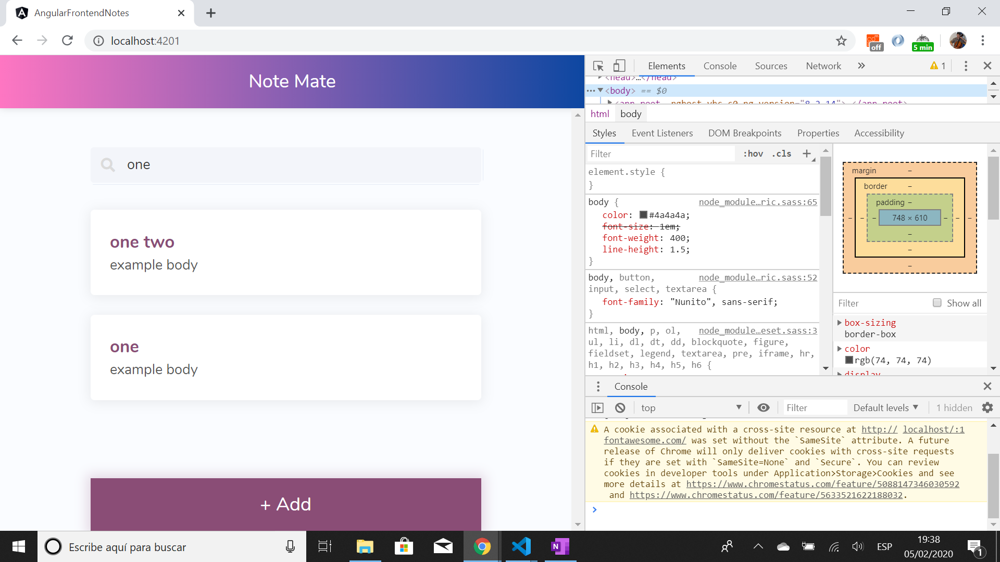

# :zap: Angular Frontend Notes

* Angular app to allow a user to Create, Read, Update & Delete (CRUD) simple notes comprising a title and description.
* Clicking on a note navigates to that note where it can be edited.
* Tutorial code by [Devstackr](https://www.youtube.com/channel/UCbwsS1m4Hib6R-9F1alus_A/featured) * see [:clap: Inspiration](#clap-inspiration) below. Note some changes were required to pass tslint tests
* **Note:** to open web links in a new window use: _ctrl+click on link_


## :page_facing_up: Table of contents

* [:zap: Angular Frontend Notes](#zap-angular-frontend-notes)
  * [:page_facing_up: Table of contents](#page_facing_up-table-of-contents)
  * [:books: General info](#books-general-info)
  * [:camera: Screenshots](#camera-screenshots)
  * [:signal_strength: Technologies](#signal_strength-technologies)
  * [:floppy_disk: Setup](#floppy_disk-setup)
  * [:computer: Code Examples](#computer-code-examples)
  * [:cool: Features](#cool-features)
  * [:clipboard: Status & To-do list](#clipboard-status--to-do-list)
  * [:clap: Inspiration](#clap-inspiration)
  * [:file_folder: License](#file_folder-license)
  * [:envelope: Contact](#envelope-contact)

## :books: General info

* Notes can be viewed and deleted from the notes list.
* Clicking on a note lets user edit it.
* Fade-out gradient used with text to keep note cards all the same size.
* List includes a filter so user can search for key words and filtered results will order themselves in terms of relevancy.
* There is no backend for this app. A refresh loses all notes from the notes array.
* [Bulma](https://bulma.io/documentation/) CSS framework used to style components etc.
* 5 part Youtube tutorial series in Angular 8. Upgraded to Angular 12.

## :camera: Screenshots



## :signal_strength: Technologies

* [Angular v12](https://angular.io/)
* [Bulma v0.9.2](https://bulma.io/documentation/) CSS framework
* [Font Awesome v5](https://fontawesome.com/) icons
* [rxjs v6](https://angular.io/guide/rx-library) reactive programming library

## :floppy_disk: Setup

* Run `npm i` to install dependencies
* To start the server on _localhost://4200_ type: 'ng serve'
* To create a build file in a `docs` folder type `ng build --prod`. This will deployed in github-pages when code is commited and pushed to Github

## :computer: Code Examples

* on initialisation of `note-details.component.ts` check if note is new using the note id.

```typescript
ngOnInit() {
  // new note or editing existing one?
  this.route.params.subscribe((params: Params) => {
    this.note = new Note();
    if (params.id) {
      this.note = this.notesService.get(params.id);
      this.noteId = params.id;
      this.new = false;
    } else {
      this.new = true;
    }
  })
}
```

## :cool: Features

* Bulma CSS styles used for the first time.

## :clipboard: Status & To-do list

* Status: Working. Passes lint test.
* To-do: Nothing. Could add local storage or a backend (e.g. google Firebase).

## :clap: Inspiration

* [Project Demo & Introduction - [1] Build a Notes App w/ Angular](https://www.youtube.com/watch?v=dlXEeOk-MrI&t=7s)
* [Creating the UI (Angular) - [2] Build a Notes App w/ Angular](https://www.youtube.com/watch?v=akUcKvEsG8w)
* [Creating the Note Details Page - [3] Build a Notes App w/ Angular](https://www.youtube.com/watch?v=Rghqrp59XJA)
* [Adding Animations to Note Cards | Angular Animations - [4] Build a Notes App w/ Angular](https://www.youtube.com/watch?v=0DnL5awucWE)
* [Searching Notes - [5] Build a Notes App w/ Angular](https://www.youtube.com/watch?v=vWt9WvjUfRA)

* [Devstackr: Github repo](https://github.com/Devstackr/basic-notes-app-mean-stack)
* [Maya Shavin: Medium article: ES6 — Set vs Array — What and when?](https://medium.com/front-end-weekly/es6-set-vs-array-what-and-when-efc055655e1a)

## :file_folder: License

* This project is licensed under the terms of the MIT license.

## :envelope: Contact

* Repo created by [ABateman](https://github.com/AndrewJBateman), email: gomezbateman@yahoo.com
